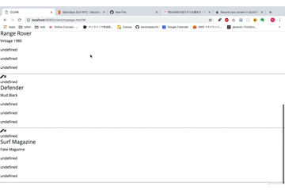

# Demo

# Service Name
CLEAR

# my-first-webservice
このソフトはどんなもので、何ができるのかを書く
合わせて、簡単なデモ（使用例）などスクリーンショットやGIFアニメで表示

# Dependency
使用言語とバージョン、必要なライブラリとそのバージョンを書く
Pythonならrequirements.txtを用意するのも良い

# Setup
セットアップ方法を書く。用意するハードウェアとソフトウェアをセットアップするためのコマンドを記載する

# Usage
使い方。なるべく具体的に書く。サンプルも書く

# Licence
This software is released under the MIT License, see LICENSE.

# Authors
Kento Takeuchi & supported by Greg Lafrance.

# References
