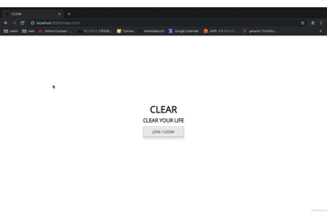

# Demo

# Service Name
CLEAR

# Description
- Users can easily manage their own items online because of visualizing them at one place.

- Users can search other users' items.
- Users can follow other users. (Coming soon...)
- Users can sell & buy their items. (Coming soon...)

# Dependency

# Setup

# Usage

# Licence
This software is released under the MIT License, see LICENSE.

# Authors
Kento Takeuchi & supported by [Greg Lafrance](https://github.com/glafrance).

# References
[https://sumally.com/](https://sumally.com/)
[https://www.mercari.com/jp/](https://www.mercari.com/jp/)
